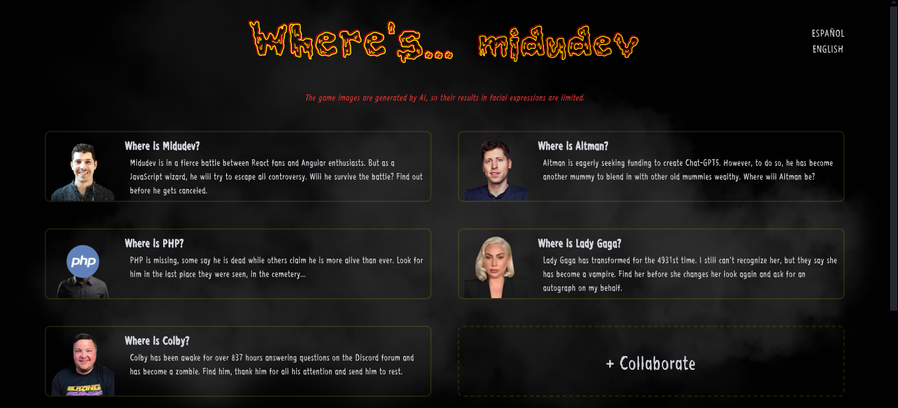

# Where's Midu

<div align="center">

**Where's Midu** is a Halloween-theme page inspired in _'Where's Waldo'_ that uses cloud technology from **Cloudinary** to enhance the resolution of images generated by AI.

[Where's Midu website](www.wheres-midu.site)



</div>

> [!NOTE]
> This project is a Hackathon project (Spooky AI Hackathon) from [Cloudinary](https://cloudinary.com/) and [Midudev](https://www.twitch.tv/midudev).

> [!IMPORTANT]
> The game images are generated by AI, so their results in facial expressions are limited.

## 👨🏻‍💻 Technologies

- 🚀 Astro
- 💫 Preact
- 🌐 HTML Canvas
- 🌟 Cloudinary:
  - Cloudinary Form Data
  - Cloudinary URL Gen
  - Cloudinary Image Upload
  - Cloudinary Image Transformation
  - Cloudinary Image Optimization

## 📦 Local installation

1. Clone the repository

```bash
git clone https://github.com/albertlnz/wheres-midu.git
```

2. Install dependencies

```bash
npm install
```

3. Create a `.env` file in the root directory and add your Cloudinary account name

```bash
CLOUDINARY_CLOUD_NAME=
CLOUDINARY_IMGS_FOLDER=wheres-midu
```

4. Run the development server 🌠

```bash
npm run dev
```

## ☕ Buy me a coffee

[](https://www.buymeacoffee.com/albertlnz)
